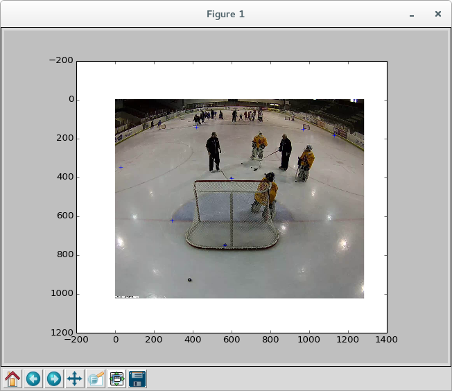

Hugin .pto File Parser
======================

Useful for image correspondences definition.

Example usage:

	import huginpto
	import matplotlib.pylab as plt
	pto = huginpto.HuginPto('test/kamera1-8.pto')
	img = plt.imread('test/kamera2.png')
	plt.imshow(img)
	print pto.get_available_correspondence_pairs()

[[0, 1], [1, 2], [2, 3], [1, 3], [1, 4], [1, 5], [4, 6], [4, 5], [4, 7]]

	c0, c1 = pto.get_correspondences(0, 1)
	c0 = np.array(c0)
	c1 = np.array(c1)
	plt.plot(c1[:, 0], c1[:, 1], '+')
	plt.show()

